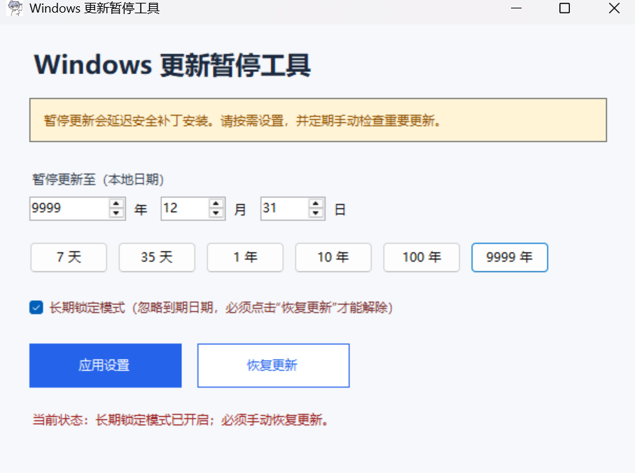

# Windows 更新暂停工具

一个无需安装的 Windows 图形化小工具，可将 Windows 更新暂停到自定义日期，也能一键恢复。

## 功能

- 自定义暂停结束日期，最高支持公元 9999 年
- 7 天、35 天、1 年、10 年、100 年和 9999 年快捷选项
- 可选“长期锁定模式”；该模式必须手动恢复
- 一键恢复更新：解除禁用策略，并将暂停截止时间调整到约 1 小时后
- 恢复时会明确提示预计恢复自动检查更新的时间范围
- 使用 Windows 自带的 .NET Framework，不捆绑第三方运行库



## 使用方法

1. 下载并运行 `WindowsUpdatePauseTool.exe`。
2. 在 Windows 管理员权限弹窗中选择“是”。
3. 选择日期，然后点击“应用设置”。
4. 如需解除，重新运行工具并点击“恢复更新”；系统将在约 1 小时后恢复自动检查更新。

本项目的公开构建未附带商业代码签名证书，因此 Windows 可能显示“未知发布者”或 SmartScreen 提示。请只从可信来源下载，并在运行前核对发布页提供的 SHA-256。

## 为什么暂停后仍可能看到更新

出现以下情况时，并不代表工具没有拦截住新的常规系统更新，而是 Windows 的正常行为：

### 暂停前已经下载、暂存的更新

如果 Windows 在应用暂停设置前已经下载更新，并显示“等待安装”或“需要重启”，该更新已经进入系统维护队列。暂停设置只能影响之后的自动更新流程，不能撤销已经暂存的安装包。因此，电脑重启时仍可能完成这项更新。

建议在使用工具前先查看 Windows 更新页面。如果页面已经提示需要重启，应当预期该更新仍会在下次重启时完成安装。

### Microsoft Defender 安全智能更新

`KB2267602` 等 Microsoft Defender 病毒库和安全智能更新有独立的更新计划，通常每天发布多次。它们体积较小，用于让杀毒功能识别最新威胁，即使普通功能更新和质量更新处于暂停状态，也可能继续下载和安装。这是预期的安全保护行为，不表示暂停设置失效。

工具主要用于控制后续的常规 Windows 功能更新、质量更新及自动更新策略，不会回滚已经进入安装队列的更新，也不会刻意阻止 Defender 安全智能更新。

相关微软说明：

- [配置 Windows 自动更新](https://learn.microsoft.com/windows/deployment/update/waas-wu-settings)
- [管理 Microsoft Defender Antivirus 保护更新](https://learn.microsoft.com/defender-endpoint/manage-protection-updates-microsoft-defender-antivirus)

## 安全说明

暂停更新会延迟 Windows 安全补丁，可能增加系统遭受漏洞攻击的风险。建议只暂停必要时长，并定期手动检查重要更新。

“长期锁定模式”会设置 Windows 的 `NoAutoUpdate` 策略，不会随日期自动解除，必须使用本工具的“恢复更新”功能手动解除。

不建议将结束日期设置为 9999 年。由于 Windows 更新界面会把 UTC 时间换算为本地时间，部分正时区可能在换算时超过日期上限并导致设置页面报错。需要长期暂停时，请使用较早的日期并开启“长期锁定模式”。

Windows 未来版本可能改变更新机制，因此超出系统设置界面允许范围的暂停日期不保证在所有版本上都有效。工具会写入并读取当前注册表状态，但不能绕过企业域策略或设备管理策略。

## 从源码构建

在 PowerShell 中运行：

```powershell
powershell -ExecutionPolicy Bypass -File .\build.ps1
```

生成文件位于 `dist` 目录。

## 系统要求

- Windows 10 或 Windows 11
- .NET Framework 4.x
- 管理员权限

## 许可证

MIT License。工具按“原样”提供，使用者自行承担暂停系统更新带来的风险。
